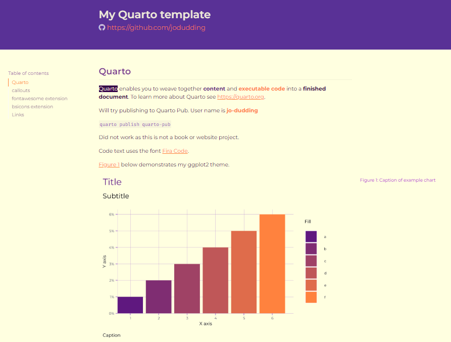
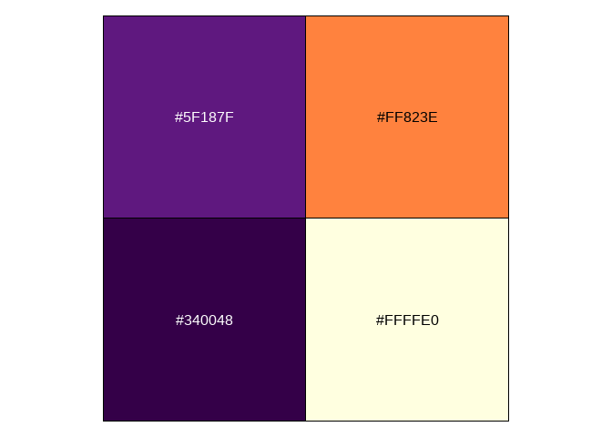
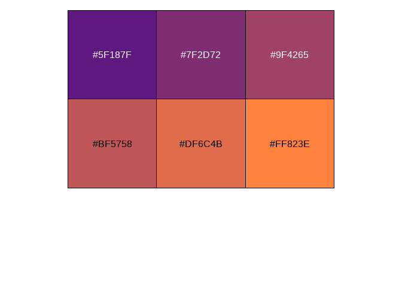

# Jo’s Quarto template

This is a repo to hold my [Quarto
template](https://github.com/JoDudding/quarto-template), which is a work
in progress.

Here’s what it looks like currently.

The colour palette is shown below.

With this gradient

